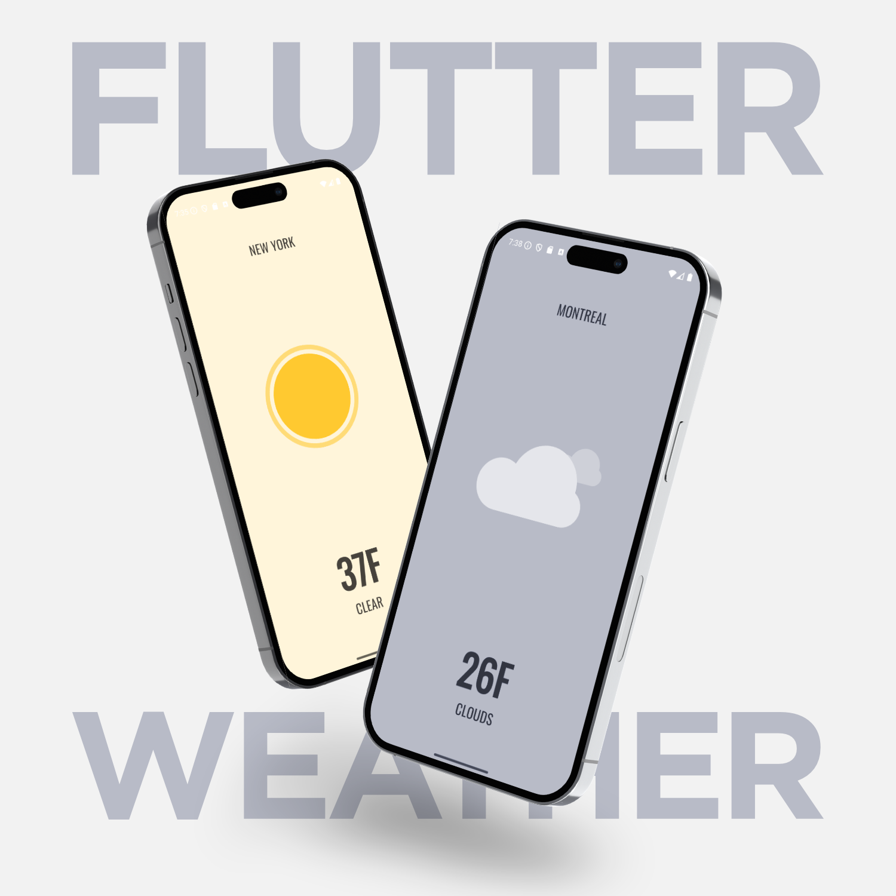

# Minimalist Weather App

A Flutter project that provides a simple, minimalist weather map. 

## 📱 About the App

Enter a city name to get the current weather, or use your location to fetch weather data from the OpenWeatherMap API.
The project includes a WeatherService class to handle API interactions and a WeatherModel class to represent temperature and weather conditions.
Animations are from the Lottie library, used for the weather icons.

 

## 💻 Screenshot

|  |
| :----------------------------------------------------------------------------: |

## ℹ️ Flutter Guide

A few resources to get you started if this is your first Flutter project:

- [Lab: Write your first Flutter app](https://docs.flutter.dev/get-started/codelab)
- [Cookbook: Useful Flutter samples](https://docs.flutter.dev/cookbook)

For help getting started with Flutter development, view the
[online documentation](https://docs.flutter.dev/), which offers tutorials,
samples, guidance on mobile development, and a full API reference.
